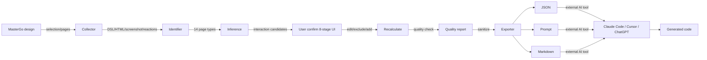

# ContextForge — Design Context Package Generator for MasterGo

<!-- Badges -->
[](./LICENSE)
[](https://www.typescriptlang.org/)
[](./CONTRIBUTING.md)


<!-- Logo placeholder -->
<!-- TODO: add project logo banner -->

**ContextForge** is a MasterGo plugin that extracts complete context from design files (page structure + interaction relationships + business rules + quality report) and generates a standardized data package for external AI tools (Claude Code / Codex / Cursor / ChatGPT) to generate interactive HTML / React / Vue demos.

> **Scope**: This plugin only reads, recognizes, infers, confirms, packages, and exports design context data. It does **NOT** generate HTML / React / Vue, nor run prototypes. Code generation is done by external AI tools based on the exported package.
>
> **Platform**: Currently a MasterGo plugin. Figma support is on the future roadmap, not yet available.

📖 [中文文档](./README.md) · English (current)

---

## Table of Contents

- [🎯 Why ContextForge?](#-why-contextforge)
- [📊 ContextForge vs Alternatives](#-contextforge-vs-alternatives)
- [✨ Features](#-features)
- [🚀 Installation & Usage](#-installation--usage)
- [🏗️ Architecture](#️-architecture)
- [🔒 Security](#-security)
- [🗺️ Roadmap](#️-roadmap)
- [🤝 Contributing](#-contributing)

---

## 🎯 Why ContextForge?

**The problem**: When designers / PMs collaborate with AI tools, they manually:
- 📸 Screenshot every page / modal / state view one by one
- 📝 Hand-write navigation flows ("click login button → go to list page...")
- 📋 Copy-paste PRD, business rules, acceptance criteria
- 🎨 Describe design specs (colors / fonts / spacing)
- 🔄 Repeat all of the above after every design change

**The result**: long prompts, easy to miss details, hard to maintain, AI-generated code drifts from the design.

**ContextForge's solution**:
- ✅ **One-click extraction**: auto-recognizes 14 page types, infers interactions, collects DSL/HTML/screenshots
- ✅ **Structured output**: standard JSON Schema, programmatically parseable by AI tools
- ✅ **Quality assurance**: 18 checks + scoring, ensures completeness before export
- ✅ **Editable confirmation**: 8-stage flow UI, users can change page types / add relations / exclude pages
- ✅ **Incremental updates**: regenerate after design changes, AI can diff the delta

---

## 📊 ContextForge vs Alternatives

| Dimension | **Manual screenshot + describe** | **MCP direct connection** | **ContextForge** |
|-----------|----------------------------------|---------------------------|------------------|
| **Page structure** | ❌ Manual, error-prone | ⚠️ Reads but no type recognition | ✅ Auto 14 types |
| **Interactions** | ❌ All hand-written | ❌ No inference | ✅ 3 inference methods + confirm |
| **Screenshot assets** | ⚠️ Manual one-by-one | ❌ Needs extra script | ✅ Auto base64 |
| **PRD context** | ⚠️ Manual paste | ❌ None | ✅ Structured fields + draft |
| **Quality checks** | ❌ None | ❌ None | ✅ 18 checks + scoring |
| **Editable confirm** | ❌ Redo on change | ❌ Live but hard to track | ✅ 8-stage UI + recalc |
| **Export formats** | ⚠️ Plain text prompt | ⚠️ Raw API JSON | ✅ JSON / Prompt / Markdown |
| **Offline use** | ✅ | ❌ Needs MCP server | ✅ In-plugin |

**Positioning**: ContextForge is the **static snapshot** version of MCP — generate one complete package after the design is finalized, for AI tools to use offline. Best for the "design → review → hand off to AI for code generation" workflow.

---

## ✨ Features

### 1. Multi-dimensional page recognition (14 types)
- **Main pages**: entry / home / list / detail / form
- **Modal / drawer**: modal / drawer
- **State views**: state_empty / state_loading / state_error / state_success
- **Components**: component / unknown

### 2. Three interaction inference methods
- **Naming rules**: recognizes keywords like "add / edit / view / back / submit"
- **Prototype links**: leverages MasterGo reactions (prototype navigation links)
- **Layout position**: infers state-view ownership from parent-child relationships

### 3. Complete data package (JSON / Prompt / Markdown)
- **Page list**: DSL + HTML + screenshot base64
- **Interactions**: fromPage → targetPage, confidence levels (high/medium/low)
- **Main flow + attachments**: auto-detects entry page and main flow
- **Quality report**: 18 checks, auto scoring (0–100)
- **PRD context**: business rules / user stories / acceptance criteria
- **AI enhancement metadata**: provider / model / usages

### 4. 8-stage flow UX
Config → Identifying → Page review → Flow confirm → PRD → AI settings → Quality preview → Export

### 5. Quality assurance
- **18 checks**: pages>1 with 0 interactions → blocking (-50), missing entry page → blocking, screenshot/DSL/HTML graded
- **Recalc after edits**: changing page types/relations auto-recalculates counts/questions/groups/report
- **Security redaction**: forced sanitize before export, redact before console forwarding, API Key never enters package

---

## 🚀 Installation & Usage

### 1. Clone the repo
```bash
git clone https://github.com/Eryooo/context-forge.git
cd context-forge
npm install
```

### 2. Build the plugin
```bash
npm run build
# or with npm only:
npm run build:ui && npm run build:main
```

### 3. Load in MasterGo
Plugins → Development → Import plugin → select `dist/manifest.json`

### 4. Use
1. Select a Frame or set scope in the plugin
2. Follow the 8-stage flow: Config → Identifying → Page review → Flow confirm → PRD → AI settings → Quality preview → Export
3. Export as JSON / Prompt / Markdown and feed to your AI tool

See [examples/](./examples/) for a sample exported package.

---

## 🏗️ Architecture

### Data flow



---

## 🔒 Security

- **API Key never enters the package**: `aiSettings` field removed, replaced with non-sensitive `aiEnhancement`
- **Double-redaction before export**: `sanitizePackageForExport` + `redactSensitive`
- **Redact before console forwarding**: API Key/token stripped from logs
- **rawPRD not in draft by default**: controlled by export option

---

## 🗺️ Roadmap

**Done** (v0.3.1):
- ✅ 14 page types + 3 inference methods
- ✅ 8-stage flow UI + user edit confirmation
- ✅ 18 quality checks + dimensional scoring
- ✅ JSON / Prompt / Markdown export
- ✅ Security redaction (API Key never in package)

**Planned**:
- ⏳ Real AI enhancement integration
- ⏳ Claude Code dedicated file package
- ⏳ ZIP package export
- ⏳ History & version management
- ⏳ Design change diff
- ⏳ Figma platform support

See [CHANGELOG.md](./CHANGELOG.md) for full history.

---

## 🤝 Contributing

Contributions welcome! See [CONTRIBUTING.md](./CONTRIBUTING.md) for development setup, code standards, and PR workflow.

## 📄 License

[MIT](./LICENSE)
