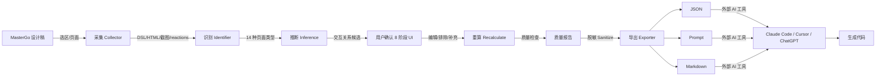
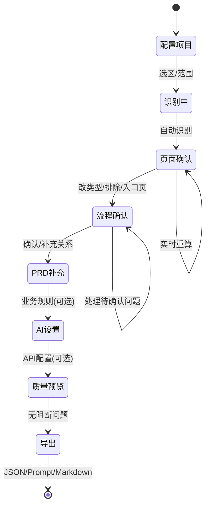
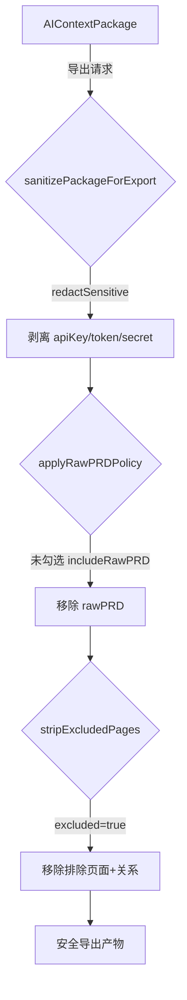

# ContextForge — MasterGo 设计上下文数据包生成器

<!-- 徽章行 -->
[](./LICENSE)
[](https://www.typescriptlang.org/)
[](./CONTRIBUTING.md)


<!-- Logo 占位区 -->
<!-- TODO: 加项目 logo 横幅图 -->

**ContextForge** 是一个 MasterGo 插件,从设计稿中提取完整上下文(页面结构 + 交互关系 + 业务规则 + 质量报告),生成标准化数据包,供外部 AI 工具(Claude Code / Codex / Cursor / ChatGPT 等)生成可交互 HTML Demo / React Demo / Vue Demo。

> **边界**:本插件只负责读取、识别、推断、确认、打包、导出设计上下文数据,**不生成 HTML / React / Vue,不运行原型**。代码生成由外部 AI 工具基于导出的数据包完成。
>
> **平台**:当前为 MasterGo 插件。Figma 适配为 future roadmap,尚未支持。

📖 **[English README](./README.en.md)** · 中文文档(当前)

---

## 目录

- [🎯 为什么需要 ContextForge?](#-为什么需要-contextforge)
- [📊 ContextForge vs 其他方案](#-contextforge-vs-其他方案)
- [✨ 核心特性](#-核心特性)
- [🚀 安装与使用](#-安装与使用)
- [🏗️ 架构](#️-架构)
- [📦 数据包 Schema](#-数据包-schema)
- [🔒 安全保障](#-安全保障)
- [🗺️ Roadmap](#️-roadmap)
- [❓ 常见问题](#-常见问题)
- [🛠️ 技术栈](#️-技术栈)
- [🧰 开发与调试](#-开发与调试)
- [🤝 贡献](#-贡献)

---

## 🎯 为什么需要 ContextForge?

**痛点**:设计师 / 产品经理和 AI 工具协作时,需要手动:
- 📸 逐个截图每个页面 / 弹窗 / 状态页
- 📝 手写页面间的跳转关系("点登录按钮跳到列表页...")
- 📋 复制粘贴 PRD、业务规则、验收标准
- 🎨 描述设计规范(颜色 / 字号 / 间距)
- 🔄 每次设计改动后重复以上所有步骤

**结果**:Prompt 长、易遗漏、难维护,AI 生成的代码和设计脱节。

**ContextForge 的解决方案**:
- ✅ **一键提取**:自动识别 14 种页面类型、推断交互关系、采集 DSL/HTML/截图
- ✅ **结构化输出**:标准 JSON Schema,AI 工具可程序化解析
- ✅ **质量保障**:18 项检查 + 评分,导出前确保数据完整
- ✅ **可编辑确认**:8 阶段流程化 UI,用户可改页面类型 / 补充关系 / 排除页面
- ✅ **增量更新**:设计改动后重新生成,AI 能 diff 出变化部分

---

## 📊 ContextForge vs 其他方案

| 对比维度 | **手动截图+描述** | **MCP 直连设计工具** | **ContextForge** |
|---------|------------------|---------------------|-----------------|
| **页面结构** | ❌ 手动描述,易遗漏 | ⚠️ 实时读但无类型识别 | ✅ 自动识别 14 种类型 |
| **交互关系** | ❌ 全靠手写 | ❌ 无推断 | ✅ 3 种推断 + 用户确认 |
| **截图资产** | ⚠️ 手动逐个截 | ❌ 需额外脚本 | ✅ 自动采集 base64 |
| **PRD 上下文** | ⚠️ 手动粘贴 | ❌ 无 | ✅ 结构化字段 + 草稿 |
| **质量检查** | ❌ 无 | ❌ 无 | ✅ 18 项检查 + 评分 |
| **可编辑确认** | ❌ 改需重头来 | ❌ 实时但难追踪 | ✅ 8 阶段 UI + 重算 |
| **导出格式** | ⚠️ 纯文本 Prompt | ⚠️ 原始 API JSON | ✅ JSON / Prompt / Markdown |
| **离线使用** | ✅ | ❌ 需 MCP 服务端 | ✅ 插件内完成 |

**定位**:ContextForge 是 MCP 的**静态快照**版——在设计定稿后生成一次完整数据包,供 AI 工具离线使用。适合"设计 → 评审 → 交付 AI 生成代码"的流程。

---

## ✨ 核心特性

### 1. 多维度页面识别(14 种类型)
- **主页面**: entry / home / list / detail / form
- **弹窗 / 抽屉**: modal / drawer
- **状态页**: state_empty / state_loading / state_error / state_success
- **组件素材**: component / unknown

### 2. 3 种交互关系推断
- **命名规则**:识别"新增/编辑/查看/返回/提交"等关键词
- **原型连线**:利用 MasterGo reactions(原型跳转连线)
- **布局位置**:根据父子关系推断状态页归属

### 3. 完整数据包(JSON / Prompt / Markdown)
- **页面清单**:DSL + HTML + 截图 base64
- **交互关系**:fromPage → targetPage,置信度分级(高/中/低)
- **主流程 + 挂载关系**:自动识别入口页和主流程
- **质量报告**:18 种检查项,自动评分(0–100)
- **PRD 上下文**:业务规则 / 用户故事 / 验收标准
- **AI 增强元信息**:provider / model / usages

### 4. 流程化 UX(8 阶段)
1. **配置项目**:项目名/范围(选中 Frame / 当前页 / 容器内)
2. **识别中...**:自动识别页面类型 + 推断交互关系
3. **页面确认**:改类型 / 重命名 / 排除,实时重算
4. **流程确认**:确认 / 修改 / 删除关系,补充主流程
5. **PRD 补充**(可选):业务规则 / 用户故事 / 原始 PRD(默认不进历史)
6. **AI 设置**(可选):OpenAI-compatible API,测试连接(6 类失败原因)
7. **质量预览**:阻断性问题 / 警告 / 建议
8. **导出**:JSON / Prompt / Markdown

### 5. 质量保障
- **18 种检查项**:页面>1 且交互=0 → blocking(-50 分),入口页缺失 → blocking,截图/DSL/HTML 分级(blocking/warning/info)
- **用户编辑后重算**:改页面类型/关系后,自动重算 counts/unresolvedQuestions/pageGroups/qualityReport
- **安全脱敏**:导出前强制 sanitize,console 转发前 redact,API Key 不进数据包/历史/快照

---

## 🚀 安装与使用

### 1. 克隆仓库
```bash
git clone https://github.com/Eryooo/context-forge.git
cd context-forge
npm install
```

### 2. 构建插件
```bash
npm run build
```

构建产物在 `dist/` 目录。

### 3. 在 MasterGo 中安装
- **MasterGo**:插件管理 → 从本地导入 → 选择 `dist/manifest.json`
- **Figma**(future roadmap):当前为 MasterGo 插件,Figma 适配为未来方向,尚未支持。

### 4. 使用
1. 在设计稿中选中要导出的 Frame(或切换到"当前页面"模式)
2. 运行插件,填写项目名/描述
3. 按流程操作(8 阶段):配置项目 → 识别中 → 页面确认 → 流程确认 → PRD 补充 → AI 设置 → 质量预览 → 导出
4. 复制导出的 JSON / Prompt,交给 Claude / GPT / Cursor 等 AI 工具生成代码

---

## 🏗️ 架构

### 数据流



### 8 阶段流程



### 安全脱敏链路



### 目录结构

```
context-forge/
├── src/
│   ├── schema/           # 数据包 Schema(TypeScript 类型定义)
│   │   ├── package-schema.ts      # AIContextPackage 根类型
│   │   ├── page-graph.ts          # PageNode / PageGraph
│   │   ├── interaction.ts         # Interaction / InteractionGraph
│   │   ├── quality-report.ts      # QualityReport / QualityIssue
│   │   └── ai-settings.ts         # AISettings(API Key 仅本地)
│   ├── modules/          # 核心业务逻辑
│   │   ├── collector.ts           # 数据采集(DSL/HTML/截图/reactions)
│   │   ├── page-identifier.ts     # 页面类型识别(命名规则+尺寸特征)
│   │   ├── relation-inference.ts  # 交互关系推断(命名+原型连线)
│   │   ├── quality-checker.ts     # 质量检查(18 种检查项)
│   │   ├── orchestrator.ts        # 主流程编排(串联所有模块)
│   │   ├── exporter.ts            # 导出(Prompt/JSON/Markdown)
│   │   ├── security/              # 安全模块
│   │   │   └── redact.ts          # redactSensitive(脱敏 apiKey/rawPRD)
│   │   ├── export/                # 导出子模块
│   │   │   └── sanitize.ts        # sanitizePackageForExport(双保险)
│   │   ├── utils/                 # 工具函数
│   │   │   └── stable-id.ts       # 哈希生成稳定 ID(替代 Date.now+Math.random)
│   │   ├── package/               # 数据包操作
│   │   │   └── recalculate.ts     # 用户编辑后重算
│   │   └── identify/              # 识别子模块
│   │       └── deep-summary.ts    # 深层扫描(maxDepth6/maxNodes1000)
│   └── lib/
│       └── main.ts       # 插件主线程入口(MasterGo API 调用)
├── ui/                   # 前端 UI(React + Vite)
│   ├── App.tsx           # 流程主界面(8 阶段)
│   ├── components/
│   │   ├── FlowConfirm.tsx        # 页面流程确认页
│   │   ├── PRDPanel.tsx           # PRD 补充面板
│   │   ├── AISettingsPanel.tsx    # AI 设置面板
│   │   └── PageReviewPanel.tsx    # 页面识别结果确认页
│   ├── ai/
│   │   └── ai-client.ts           # OpenAI-compatible API 调用(UI iframe 侧)
│   └── diag.ts           # 诊断快照(调试用)
├── messages/             # 主线程 ↔ UI 通信协议
│   └── sender.ts
├── dist/                 # 构建产物
│   ├── main.js           # 主线程 bundle
│   ├── index.html        # UI iframe
│   └── manifest.json     # 插件清单
├── ITERATION-PLAN-R2.md  # 迭代 R2 计划(15 步改造)
└── README.md
```

---

## 📦 数据包 Schema

导出的 JSON 数据包结构:

```json
{
  "packageMeta": {
    "schemaVersion": "1.0.0",
    "exportTool": "ContextForge",
    "exportMode": "selected_frames",
    "exportedAt": 1703001234567,
    "aiEnhanced": false,
    "buildId": "mvp-r2"
  },
  "project": {
    "name": "任务管理系统 MVP",
    "description": "...",
    "documentId": 123456
  },
  "pageList": {
    "pages": [
      {
        "pageId": "page_abc123",
        "pageName": "任务列表页",
        "pageType": "list",
        "typeConfidence": 0.85,
        "nodeId": "abc123",
        "summary": { "layout": "vertical", "mainRegions": [...], ... },
        "dslStatus": "success",
        "htmlStatus": "unavailable",
        "screenshotStatus": "success"
      }
    ]
  },
  "pageGraph": {
    "mainFlow": ["page_entry", "page_home", "page_list", "page_detail"],
    "entryPage": "page_entry",
    "pageGroups": [...]
  },
  "interactionGraph": {
    "interactions": [
      {
        "id": "int_3a4b7c21",
        "interactionType": "overlay",
        "fromPage": "page_list",
        "triggerElement": "新增按钮",
        "actionType": "openModal",
        "targetType": "overlay",
        "targetOverlayId": "page_modal_add",
        "confidence": 0.9,
        "source": ["prototype", "naming"],
        "confirmedByUser": false,
        "naturalLanguage": "..."
      }
    ],
    "unresolvedQuestions": [...],
    "totalInteractions": 15,
    "highConfidenceCount": 10,
    "userConfirmedCount": 0
  },
  "prdContext": {
    "summary": "用户可查看任务列表、新增任务、进入详情。",
    "businessRules": [...],
    "userStories": [...],
    "acceptanceCriteria": [...],
    "specialRules": [...]
  },
  "assets": {
    "pages": {
      "page_abc123": {
        "dsl": { ... },
        "html": "...",
        "screenshotBase64": "data:image/png;base64,...",
        "screenshotMime": "image/png",
        "dslSource": "codegen"
      }
    }
  },
  "qualityReport": {
    "score": 75,
    "checks": { ... },
    "blockingIssues": [...],
    "warnings": [...],
    "unresolvedQuestions": [...]
  },
  "aiEnhancement": {
    "enabled": false,
    "provider": "openai-compatible",
    "model": "gpt-4",
    "usages": { ... }
  },
  "collectionStats": { ... },
  "aiExecutionInstruction": { ... }
}
```

---

## 🔒 安全保障

### 1. API Key 不进数据包
- `aiSettings.apiKey` **从不**进入数据包(`AIContextPackage.aiEnhancement` 仅含 provider/model/usages)
- 仅保存到 `clientStorage`(本地持久化),不经主线程转发

### 2. 导出前双保险脱敏
- `sanitizePackageForExport`:深拷贝 + `redactSensitive`(剥离 apiKey/authorization/bearer/token/secret/rawPRD 等)
- `applyRawPRDPolicy`:用户未勾选 `includeRawPRD` 时,强制删除 `prdContext.rawPRD`

### 3. console 转发前脱敏
- 主线程 console.log/warn/error 转发到 UI iframe 前,调 `redactArgs`(redactSensitive 批量处理)
- 防止 apiKey/rawPRD 泄漏到调试快照

### 4. PRD 草稿不含 rawPRD
- `SAVE_PRD_DRAFT` 主线程侧二次剥离 `rawPRD`(UI 已剥离,主线程再兜底)
- rawPRD 默认不进历史记录(审计 B4)

---

## 🗺️ Roadmap

**已完成**(v0.3.1):
- ✅ 14 种页面类型识别 + 3 种关系推断
- ✅ 8 阶段流程化 UI + 用户编辑确认
- ✅ 18 项质量检查 + 分项评分
- ✅ JSON / Prompt / Markdown 导出
- ✅ 安全脱敏(API Key 不进数据包)
- ✅ 入口页 / 排除页面 / 待确认问题处理

**计划中**:
- ⏳ AI 增强真正接入(页面语义 / 关系推断 / PRD 摘要)
- ⏳ Claude Code 专用文件包(.claude 目录结构)
- ⏳ ZIP 数据包导出(资产分离)
- ⏳ 历史记录与版本管理
- ⏳ 设计变更 diff(增量更新)
- ⏳ Figma 平台适配
- ⏳ 单元测试覆盖

完整变更历史见 [CHANGELOG.md](./CHANGELOG.md)。

---

## 📝 迭代记录

完整迭代历史与版本变更见 **[CHANGELOG.md](./CHANGELOG.md)**。

- **R3.1**(v0.3.1):验收补丁 — excluded 全链路移除、导出防丢编辑、CSS 修复、ErrorBoundary
- **R3**(v0.3.0):MVP 闭环 — 导出当前包、手动新增/编辑关系、入口页/排除、分项评分
- **R2**(v0.2.0):安全 + 质量 + 流程化 — API Key 不进包、18 项质量检查、8 阶段 UI
- **R1**(v0.1.0):MVP 基础 — 14 种页面识别、关系推断、三层降级采集、三格式导出

---

## ✅ 审计清单

完整审计清单及修复状态见项目根目录 **AUDIT-16Q-CHECKLIST.md**(16 问审计,每问覆盖 1–5 个代码位置)。

**核心审计项(全部修复)**:
- ✅ **A01**:API Key 泄漏风险(删 aiSettings,改 aiEnhancement,双保险脱敏)
- ✅ **A04/A05**:assets 内联(真实 DSL/HTML/screenshot base64)
- ✅ **A12**:0 关系不可高分(blocking -50,生成 unresolvedQuestion)
- ✅ **A15**:0 关系空状态(原因+补救入口)
- ✅ **B4**:rawPRD 默认不进历史(草稿排除+导出开关)

---

## ❓ 常见问题

### 1. 为什么截图 / DSL / HTML 缺失?
- **截图缺失**:节点过大(>10000px)或导出失败 → 重新选中较小范围
- **DSL 缺失**:MasterGo codegen API 不可用 → 在 DevMode 下重新导出,或接受降级(用 node tree 摘要)
- **HTML 缺失**:非 DevMode 环境 → 如需 HTML,在 DevMode 下重新导出

### 2. 为什么质量评分低?
- 页面>1 但交互=0 → blocking -50 分,建议:① 添加原型连线(reactions);② 规范按钮命名("新增/编辑/查看");③ 手动补充主流程
- 截图/DSL 全缺 → blocking -20 分,建议重新导出
- 入口页缺失 → blocking -30 分,建议手动设为入口页

### 3. 为什么页面类型识别错误?
- **类型优先级**:modal/drawer > form,如"新增任务弹窗"被识别为 modal(正确),而非 form
- 在"页面确认"步骤手动改类型,改后自动重算

### 4. 如何补充主流程?
- 在"流程确认"步骤,点"手动新增关系"按钮,选择 fromPage → actionType → targetPage
- 或在 MasterGo 中添加原型连线(reactions),重新生成数据包

### 5. 如何使用 AI 增强?
- 在"AI 设置"步骤,填写 OpenAI-compatible API(baseUrl + apiKey + model)
- 点"测试连接"(6 类失败原因:① Key 错 ② URL 错 ③ CORS ④ 网络 ⑤ 跨域 ⑥ 未知)
- 勾选增强用途(页面语义/关系推断/PRD 摘要/Prompt 压缩/质量校验)
- **注意**:OpenAI 官方端点通常拒绝浏览器跨域,需使用支持 CORS 的兼容代理/企业网关,或改用"导出后交外部 AI"模式

---

## 🛠️ 技术栈

- **插件框架**:MasterGo Plugin API
- **前端**:React + Vite + TypeScript
- **构建**:esbuild(main) + Vite(UI)
- **数据采集**:MasterGo codegen API(DSL) + exportAsync(截图) + reactions(原型连线)
- **AI 增强**(可选):OpenAI-compatible chat completion API

---

## 🧰 开发与调试

### 1. 开发模式
```bash
npm run dev:ui    # UI 热更新(localhost:3000)
npm run dev:main  # 主线程 watch 模式
```

### 2. 类型检查
```bash
npm run typecheck
```

### 3. 调试
- 在插件 UI 右下角点"诊断"按钮,查看主线程日志 / 环境信息 / probe 结果
- 导出诊断快照(JSON),可离线分析

---

## 📄 License

MIT

---

## 🤝 贡献

欢迎提 Issue / PR。审计清单和迭代计划在项目根目录,修复请对应审计项编号。

---

**ContextForge — 让设计稿成为 AI 可理解的上下文数据包。**
